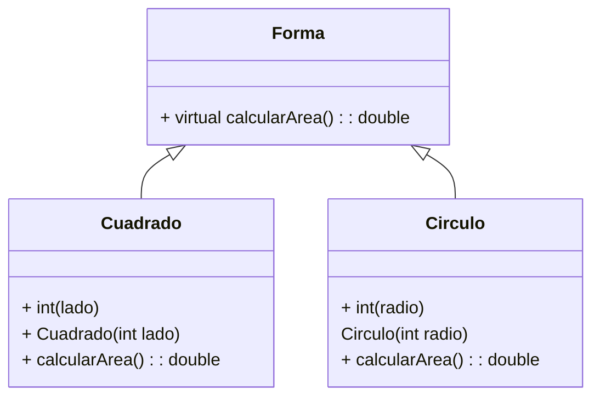

```mermaid
classDiagram
    class  Circulo{
        + int(radio)
        Circulo(int radio)
        + calcularArea() : double
    }
    class Cuadrado {
        + int(lado)
        + Cuadrado(int lado)
        + calcularArea() : double
    }
    class Forma{
        + virtual calcularArea() : double
    }
    Forma <|-- Cuadrado
    Forma <|-- Circulo
```